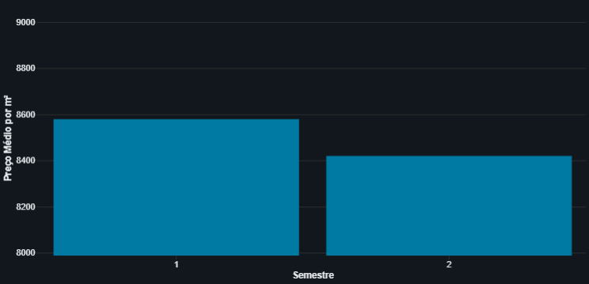
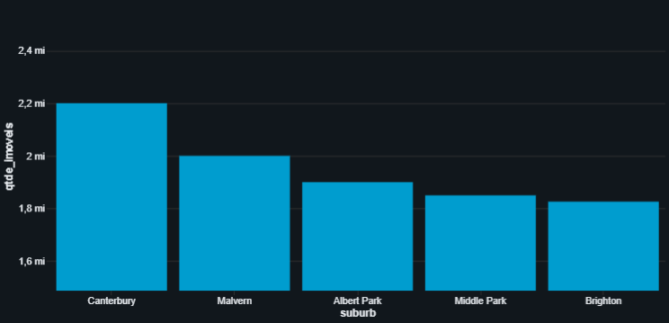
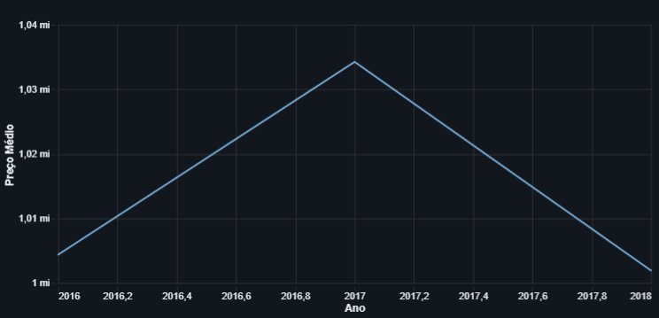

# Melbourne Housing Market - End-to-End ETL Pipeline (Databricks)

An end-to-end ETL and data analysis project using **PySpark** on **Databricks** focused on the Melbourne real estate market.

## 1. Overview & Objectives

Developed as part of the BI & Big Data curriculum at FATEC Tatuí, this project implements a complete Extraction, Transformation, and Load (ETL) process and data analysis of the housing market in Melbourne, Australia.

The primary goal was to ingest data from heterogeneous sources (.csv and .json), apply advanced cleaning and transformation techniques to create a unified and reliable dataset (**Silver layer**), and finally extract business insights through aggregated analytics (**Gold layer**).

## 2. Solution Architecture

To ensure organization, scalability, and maintainability, the project follows the **Medallion Architecture**, an industry standard for modern data platform design:

- 🥉 **Bronze Layer:** Raw data ingestion exactly as received from the original sources (CSV and JSON).
- 🥈 **Silver Layer:** The "Source of Truth". Contains cleaned, standardized, unified, and enriched data ready for analysis.
- 🥇 **Gold Layer:** Business-level aggregates and final insights that answer specific business questions.

## 3. Tech Stack

- **Platform:** Databricks
- **Language:** Python
- **Engine:** Apache Spark (PySpark)
- **Local Investigation:** Pandas (used for initial structural debugging)

## 4. The ETL Process: From Bronze to Silver

The transformation stage was the most critical part of the project, requiring detailed root-cause analysis to solve structural data issues.

### 4.1. Ingestion & Structural Error Discovery

- **Ingestion:** Files were uploaded via Databricks Volumes.
- **The Challenge:** During initial testing, a structural error was found in the CSV file. A local investigation script (found in `/investigation`) revealed: `Error tokenizing data. C error: Expected 21 fields in line 11, saw 22`.
- **Solution:** The PySpark reader was configured with `mode = "DROPMALFORMED"` to automatically discard corrupted lines, making the pipeline resilient to source formatting errors.

### 4.2. The Main Obstacle: The Hidden `CAST` Error

The biggest challenge was a persistent `[CAST_INVALID_INPUT]` error during DataFrame union operations.

- **Symptom:** The error pointed to a date conversion issue that seemed visually correct but persisted after multiple fix attempts.
- **Root Cause:** A detailed schema investigation revealed **data type inconsistency**. Spark inferred the `date` column as `Date` type in the CSV, but as `String` in the JSON.
- **Definitive Solution:** To resolve the conflict, I implemented **Schema Harmonization** before the union. All columns from both DataFrames were temporarily cast to `String`, allowing for a stable and safe union, followed by a controlled final casting.

### 4.3. Data Quality & Feature Engineering

- **Standardization:** Manually renamed all columns to `snake_case` (e.g., `Propertycount` -> `property_count`) for consistency.
- **Handling Missing Values:** Critical columns like `BuildingArea` and `YearBuilt` had nulls filled with the **median** value of their respective suburb—a more robust approach against outliers than using the mean.
- **Feature Engineering:** Created the `age_of_property` column based on the sale year and construction year to enrich the dataset for future analysis.

## 5. Analytics & Insights (Gold Layer)

With the Silver layer validated, the following business questions were answered:

### Analysis 1: Price/sqm Variation for 'Houses' in 2017
* **Insight:** Monitoring the appreciation or depreciation of house prices per square meter throughout the year.
* **Result:** 

### Analysis 2: Top 5 Suburbs by Median Price
* **Insight:** Identifying the most expensive suburbs, filtering for those with a relevant market volume (min. 50 listings).
* **Result:** 

### Analysis 3: Annual Price Evolution
* **Insight:** Visualizing the average property price trend over the years.
* **Result:** 

## 6. Conclusion

This project demonstrates a complete ETL lifecycle in a real-world scenario. It highlights that complex data challenges are often hidden under misleading symptoms. Detailed schema investigation and data harmonization before unification were crucial to the success and stability of this Big Data pipeline.