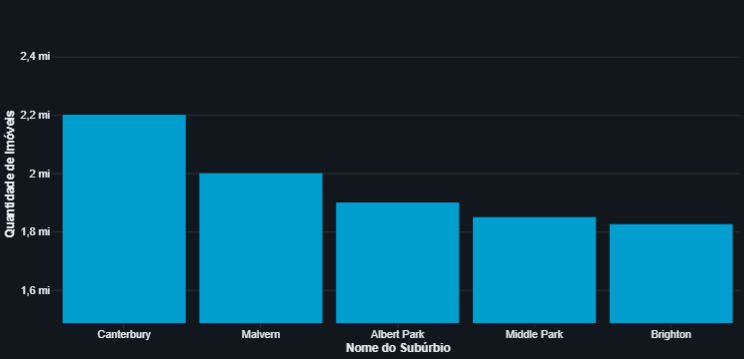

# databricks-melbourne-housing-etl
Projeto de ETL e análise com PySpark no Databricks para o mercado imobiliário de Melbourne.

## 1. Introdução e Objetivo

Este projeto, desenvolvido para a disciplina de BI e BIG DATA da FATEC Tatuí, realiza um processo completo de Extração, Transformação e Carga (ETL) e análise de dados do mercado imobiliário da cidade de Melbourne, Austrália.

O objetivo principal foi ingerir dados de fontes heterogêneas (.csv e .json), aplicar técnicas avançadas de limpeza e transformação para criar um dataset unificado e confiável (camada Silver) e, por fim, extrair insights de negócio através de análises agregadas (camada Gold).

## 2. Arquitetura da Solução

Para garantir a organização, escalabilidade e manutenibilidade do pipeline, foi utilizada a **Arquitetura Medalhão**, uma prática padrão em projetos de dados modernos:

-   **Camada Bronze:** Contém os dados brutos, exatamente como foram recebidos das fontes originais (CSV e JSON).
-   **Camada Silver:** O coração do projeto. Contém os dados limpos, padronizados, unificados e enriquecidos, prontos para a análise.
-   **Camada Gold:** Apresenta os dados agregados e os insights finais que respondem às perguntas de negócio.

## 3. Tecnologias Utilizadas

-   **Plataforma:** Databricks
-   **Linguagem:** Python
-   **Framework:** Apache Spark (PySpark)
-   **Bibliotecas (Investigação Local):** Pandas

## 4. O Processo de ETL (Da Camada Bronze para a Silver)

O processo de transformação foi a etapa mais desafiadora e crítica do projeto, exigindo uma investigação detalhada para identificar a causa raiz dos problemas.

### 4.1. Ingestão e Descoberta de Erro Estrutural

-   **Ingestão:** Os arquivos `.csv` e `.json` foram carregados na plataforma via Databricks Volumes.
-   **Desafio:** Durante a investigação de erros de conversão, uma análise local com Python/Pandas (cujos scripts estão na pasta `/investigation`) revelou um erro estrutural no arquivo CSV: `Error tokenizing data. C error: Expected 21 fields in line 11, saw 22`.
-   **Solução:** A opção `mode = "DROPMALFORMED"` foi adicionada na leitura do CSV com PySpark para descartar automaticamente a linha corrompida, tornando o pipeline resiliente a erros de formatação na origem.

### 4.2. O Principal Desafio: O Erro de `CAST` Oculto

O maior obstáculo do projeto foi um erro persistente de `[CAST_INVALID_INPUT]` que ocorria durante a unificação dos DataFrames.

-   **Sintoma:** O erro apontava para a conversão de uma data que, visualmente, parecia correta, e persistia mesmo após múltiplas tentativas de correção.
-   **Causa Raiz:** A investigação dos *schemas* revelou a verdadeira causa: uma **inconsistência de tipos de dados**. O Spark inferiu a coluna `date` como tipo `Date` no CSV, mas como `String` no JSON. Ao tentar a união, o Spark forçava uma conversão implícita (e falha) em segundo plano.
-   **Solução Definitiva:** Para resolver o conflito, foi necessário **harmonizar os schemas ANTES da união**. Todas as colunas de ambos os DataFrames foram temporariamente convertidas para `String`. Isso permitiu uma unificação segura e estável, eliminando o erro.

### 4.3. Outros Tratamentos Aplicados

-   **Padronização de Nomes:** Todas as colunas foram renomeadas manualmente para o padrão `snake_case` (ex: `Propertycount` -> `property_count`) para consistência e legibilidade.
-   **Tratamento de Nulos:** Colunas vitais como `BuildingArea` e `YearBuilt` tiveram seus valores nulos preenchidos com a **mediana** do respectivo subúrbio, uma abordagem mais robusta a outliers do que a média.
-   **Engenharia de Features:** Foi criada a coluna `age_of_property` a partir do ano da venda e do ano de construção, enriquecendo o dataset para futuras análises.

## 5. Análises e Insights (Camada Gold)

Com o dataset limpo e validado na camada Silver, foram geradas as seguintes análises:

### Análise 1: Variação do Preço/m² para 'Houses' em 2017

* **Pergunta:** O preço por metro quadrado para casas valorizou ou desvalorizou ao longo de 2017?
* **Resultado:** 

### Análise 2: Top 5 Subúrbios por Mediana de Preço

* **Pergunta:** Quais os subúrbios mais caros, considerando apenas aqueles com um mercado relevante (mínimo de 50 imóveis listados)?
* **Resultado:** 

### Análise 3: Evolução Anual dos Preços

* **Pergunta (Adaptada):** Qual a tendência do preço médio dos imóveis ao longo dos anos?
* **Resultado:** 

## 6. Conclusão

Este projeto demonstrou um ciclo completo de ETL em um cenário real, destacando que os desafios mais complexos muitas vezes estão ocultos sob sintomas enganosos. A investigação detalhada dos schemas e a harmonização dos dados antes da união foram cruciais para o sucesso e a estabilidade do pipeline.
